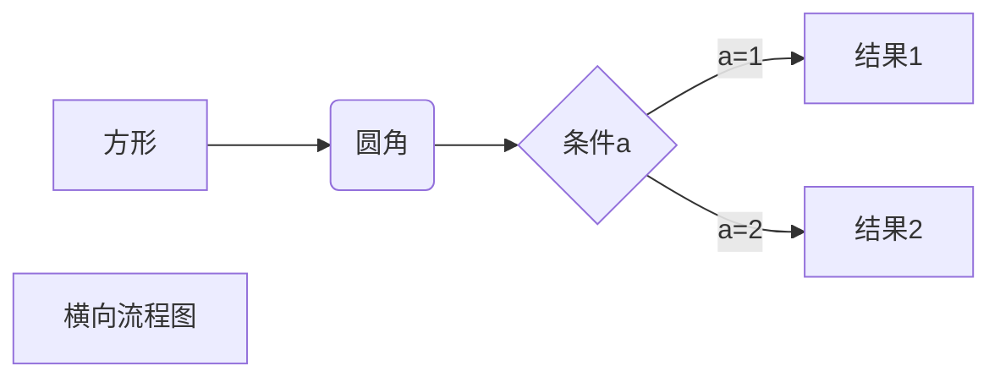
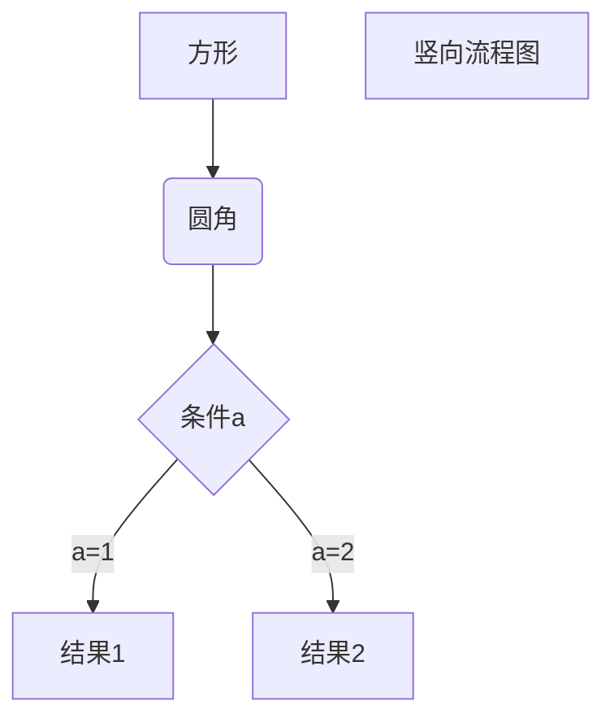
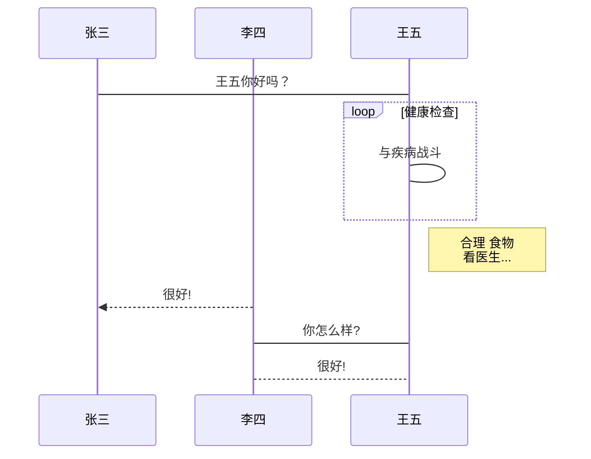
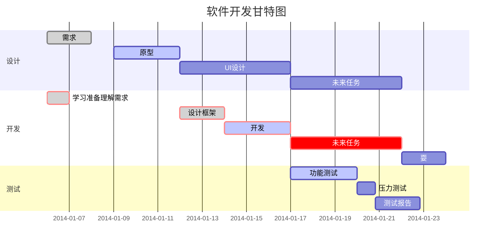

# 1. 标题
# 一级标题
## 二级标题
### 三级标题
#### 四级标题
##### 五级标题

# 2.文本
*斜体文本*
_斜体文本_
**粗体文本**
__粗体文本__
***粗斜体文本***
___粗斜体文本___

~~添加删除线~~

<u>带下划线文本</u>

创建脚注格式类似这样[^RUNOOB]
[^RUNOOB]: 菜鸟教程 -- 学的不仅是技术，更是梦想！！！

# 3. 段落
分割线
***

* * *

*****

- - -

----------


# 4. 列表
- 列表1
- 列表2

或

+ 列表3
+ 列表4

或

* 列表5
* 列表6
  * 嵌套列表1
  * 嵌套列表2
    * 嵌套列表3
    * 嵌套列表4
    * **按下enter键后按下tab即可**


1. 列表内容
2. 列表内容
3. 列表内容

# 5. 表格

<style>
table th:first-of-type {
    width: 50%;
}
table th:nth-of-type(2) {
    width: 30%;
}
table th:nth-of-type(3) {
    width: 50%;
}
</style>

| 左对齐 | 右对齐 | 居中对齐 |
| :-----| ----: | :----: |
| 单元格 | 单元格 | 单元格 |
| 单元格 | 单元格 | 单元格 |

## 说明：
+ 第二行分割表头和内容
+ 第二行减号有一个就行，多加几个也无所谓
>-: 设置内容和标题栏居右对齐。
>:- 设置内容和标题栏居左对齐。
>:-: 设置内容和标题栏居中对齐


# 6. 区块

>引用的内容
>一级区块
>>二级区块
>>引用的文字
>>>三层嵌套

>引用的内容2
- 1
- 2
  1. 第一项
  2. 第二项
   > 列表中的区块
   > 学的不是技术是梦想


# 7. 代码
`单行代码`

```c
void func(viod)
{
  prinf("hello world");//多行代码
}
```
# 8. 链接


[超链接名](超链接地址 "超链接title")

直接使用链接地址:<https://www.runoob.com>

结合下表[Google][^谷歌地址]

[^谷歌地址]:http://www.google.com/


开头一个感叹号 !
接着一个方括号，里面放上图片的替代文字
接着一个普通括号，里面放上图片的网址，最后还可以用引号包住并加上选择性的 'title' 属性的文字。


# 9.高级技巧

 <kbd>Ctrl</kbd>+<kbd>Alt</kbd>+<kbd>Del</kbd> 重启电脑

 目前Markdown支持的 HTML 元素有：\<kbd> \<b> <i> \<em> \<sup> \<sub> \<br> 等

 ## 9.1 公式
 $f(x)=sinx(x)+12

 $$
\begin{Bmatrix}
   a & b \\
   c & d
\end{Bmatrix}
$$
$$
\begin{CD}
   A @>a>> B \\
@VbVV @AAcA \\
   C @= D
\end{CD}
$$
# 9.2 流程图
1、横向流程图源码格式：


2、竖向流程图源码格式：


3、标准流程图源码格式：

```flow
st=>start: 开始框
op=>operation: 处理框
cond=>condition: 判断框(是或否?)
sub1=>subroutine: 子流程
io=>inputoutput: 输入输出框
e=>end: 结束框
st->op->cond
cond(yes)->io->e
cond(no)->sub1(right)->op
```
4、标准流程图源码格式（横向）：

```flow
st=>start: 开始框
op=>operation: 处理框
cond=>condition: 判断框(是或否?)
sub1=>subroutine: 子流程
io=>inputoutput: 输入输出框
e=>end: 结束框
st(right)->op(right)->cond
cond(yes)->io(bottom)->e
cond(no)->sub1(right)->op
```
5、UML时序图源码样例：

```sequence
对象A->对象B: 对象B你好吗?（请求）
Note right of 对象B: 对象B的描述
Note left of 对象A: 对象A的描述(提示)
对象B-->对象A: 我很好(响应)
对象A->对象B: 你真的好吗？
```
6、UML时序图源码复杂样例：

```sequence
Title: 标题：复杂使用
对象A->对象B: 对象B你好吗?（请求）
Note right of 对象B: 对象B的描述
Note left of 对象A: 对象A的描述(提示)
对象B-->对象A: 我很好(响应)
对象B->小三: 你好吗
小三-->>对象A: 对象B找我了
对象A->对象B: 你真的好吗？
Note over 小三,对象B: 我们是朋友
participant C
Note right of C: 没人陪我玩
```
7、UML标准时序图样例：


8、甘特图样例：



 ```mermaid
graph LR
sdio[ns_sdio.h] ==> sdio_wifi_cmd[sdio_wifi_cmd.h]
wireless_link_components_conf[wireless_link_components_conf.h] ==> marvell88w8801_core[marvell88w8801_core.h]
sdio_wifi_cmd ==> marvell88w8801_core
marvell88w8801_core ==> wifi_app[wifi.h]
lwip[lwip] ==> wifi_app

wifi_app ==> main[main.c]
CJSON[cjson.h] ==> main
```

